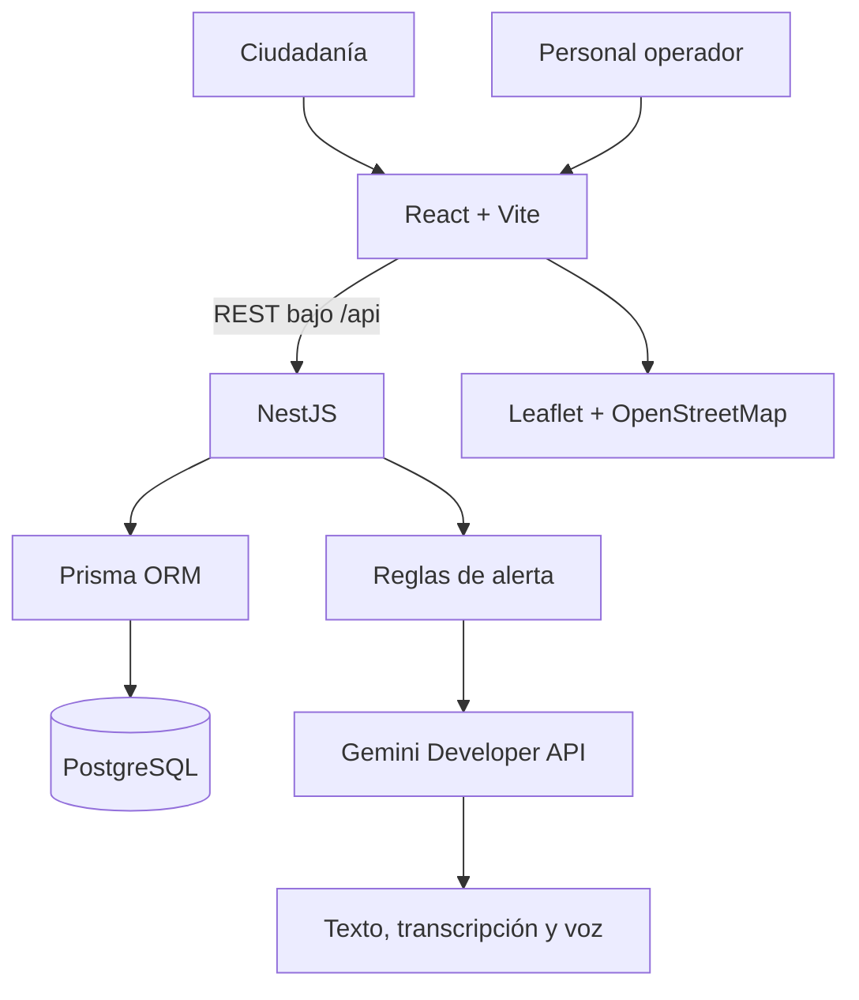
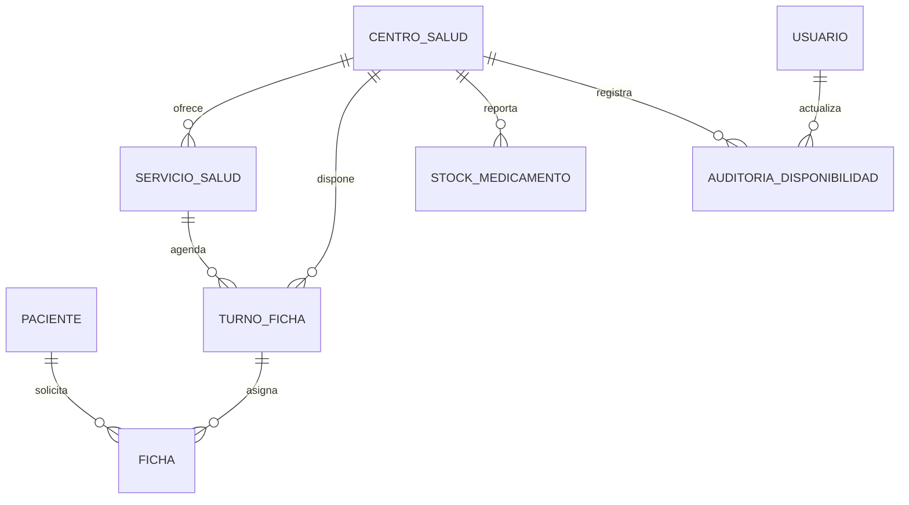

# SaludCerca — Arquitectura actual

## 1. Propósito

SaludCerca orienta a la ciudadanía de La Paz hacia centros municipales, recomienda alternativas cercanas y permite solicitar una ficha de manera rápida. Es un prototipo académico: el stock, cupos, horarios y parte de la información operativa son demostrativos.

El asistente brinda orientación inicial. No diagnostica ni prescribe; primero se aplican reglas locales de alerta y, si corresponde, se deriva a atención inmediata.

## 2. Vista general



En Render, React y NestJS se publican en el mismo Web Service. Esto evita CORS entre dominios y entrega HTTPS para geolocalización y micrófono en móvil.

## 3. Frontend

| Área | Responsabilidad |
|---|---|
| Inicio | Explica el servicio, ofrece acceso rápido a mapa, ficha y asistente. |
| Centros | Búsqueda, filtro, mapa, marcadores, permisos de ubicación y recomendación por cercanía. |
| Ficha | Selección de turno, datos mínimos del paciente, seguros médicos, confirmación y alternativas cercanas. |
| Mis fichas | Consulta y cancelación mediante C.I. |
| Asistente | Chat, captura de audio, transcripción, orientación, alertas y voz opcional. |
| Operador | Actualización de apertura, cupos y espera de los centros. |

La interfaz usa iconos SVG, animaciones, tipografía ampliada, diseño adaptable y tema claro/oscuro sincronizado con `prefers-color-scheme`.

## 4. Backend

```text
backend/src/
├── assistant/      # Gemini, alertas, chat, transcripción y síntesis
├── appointments/   # fichas públicas por paciente y compatibilidad JWT heredada
├── auth/           # JWT, bcryptjs, roles y guardas de operador
├── centers/        # catálogo, turnos, disponibilidad y stock
├── database/       # PrismaService
├── health.controller.ts
├── app.module.ts
└── main.ts
```

El prefijo global es `/api`. NestJS valida DTOs con `class-validator` y escucha en `0.0.0.0` para permitir pruebas de red local.

## 5. Datos y privacidad



- `Paciente` guarda nombre, seguro, hash de C.I. y últimos cuatro caracteres; no guarda el C.I. en texto plano.
- `Ficha` se vincula a un paciente, turno y código único de atención.
- Una persona puede tener solo una ficha activa.
- `Usuario` se conserva para el rol de operador y flujos JWT previos.
- `CatalogoCentroMunicipal` conserva procedencia y estado de verificación de coordenadas.

## 6. Flujos

### Centro recomendado

1. React consulta `GET /api/centers`.
2. La persona aprueba el permiso de ubicación.
3. El cliente calcula distancia aproximada, ordena centros y enfoca el marcador seleccionado.
4. En la reserva se muestran alternativas cercanas con cupos.

### Ficha sin cuenta

1. La persona elige centro y horario.
2. Completa nombres, C.I. y seguro médico.
3. React envía `POST /api/appointments`.
4. NestJS valida los datos, genera o actualiza el paciente, comprueba que no tenga una ficha activa y reserva el cupo.
5. La respuesta devuelve un número de ficha. Más adelante se consulta con `POST /api/appointments/history` usando el C.I.

### Asistente

1. La consulta llega por texto o audio.
2. Si hay audio, se transcribe temporalmente.
3. Las reglas de alerta identifican señales como dificultad respiratoria, dolor intenso de pecho, pérdida de conciencia, convulsiones, sangrado abundante o signos compatibles con ACV.
4. Si no hay alerta, Gemini devuelve una orientación breve, prudente y no diagnóstica.
5. El navegador puede reproducir la respuesta en voz si la persona lo activa.

### Operación

1. Un operador inicia sesión con su cuenta de personal.
2. Puede actualizar apertura, cupos y espera desde el panel.
3. La API protege el cambio con JWT y rol `OPERATOR`.
4. Se registra una auditoría de disponibilidad.

## 7. API principal

| Método | Ruta | Acceso |
|---|---|---|
| `GET` | `/api/health` | Público |
| `GET` | `/api/centers` | Público |
| `GET` | `/api/centers/:id` | Público |
| `GET` | `/api/centers/:id/availability` | Público |
| `GET` | `/api/centers/:id/slots` | Público |
| `PATCH` | `/api/centers/:id/availability` | Operador |
| `POST` | `/api/appointments` | Público; requiere datos del paciente |
| `POST` | `/api/appointments/history` | Público; requiere C.I. |
| `POST` | `/api/appointments/:id/cancel` | Público; requiere C.I. del titular |
| `POST` | `/api/assistant/chat` | Público |
| `POST` | `/api/assistant/transcribe` | Público |
| `POST` | `/api/assistant/speak` | Público |

Las rutas `GET /api/appointments/me` y `DELETE /api/appointments/:id` siguen disponibles para el flujo JWT heredado.

## 8. Configuración y despliegue

Variables principales: `DATABASE_URL`, `PORT`, `JWT_SECRET`, `AI_PROVIDER`, `GEMINI_API_KEY` y modelos Gemini. La plantilla está en `backend/.env.example`.

Para desarrollo se ejecutan Vite en `http://localhost:5173`, NestJS en `http://localhost:3000/api` y PostgreSQL local o remoto. En producción, `render.yaml` construye frontend y backend, aplica migraciones, carga datos idempotentes y arranca NestJS.

## 9. Pendientes para producción

- Validar oficialmente centros, servicios, horarios, contactos y coordenadas.
- Integrar cupos y stock con fuentes operativas reales.
- Aplicar límites de solicitud, monitoreo, copias de seguridad y CORS restringido.
- Agregar pruebas automatizadas, OpenAPI/Swagger y una política institucional de protección de datos.
