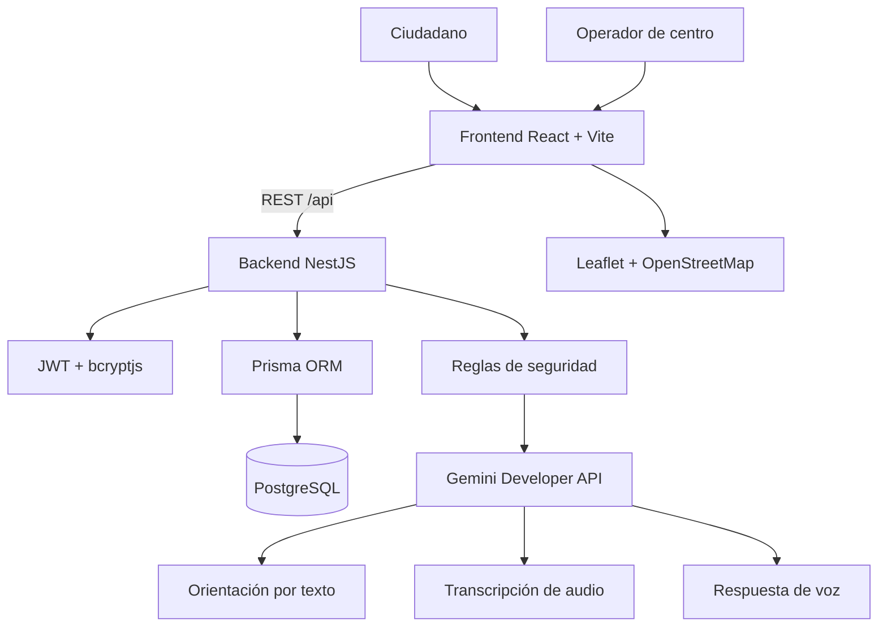
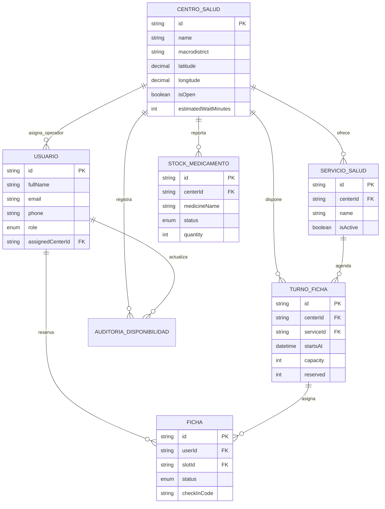

# SaludCerca — Arquitectura actual

## 1. Propósito y alcance

SaludCerca orienta a personas de La Paz hacia centros municipales de salud, facilita la reserva de una ficha y permite a operadores actualizar información operativa. Es un proyecto académico con datos de disponibilidad y stock simulados.

El asistente brinda **orientación inicial**, no diagnóstico ni tratamiento. Las reglas de alerta se evalúan antes de consultar el modelo generativo para recomendar atención inmediata cuando corresponda.

## 2. Arquitectura implementada



## 3. Componentes

| Componente | Tecnología | Responsabilidad |
|---|---|---|
| Cliente web | React + TypeScript + Vite | Vistas ciudadanas, autenticación, reservas, mapa, asistente y panel de operador. |
| Mapa | React Leaflet + OpenStreetMap | Marcadores, visualización de centros y distancia aproximada. |
| API | NestJS | API REST, validación de entradas, roles, reservas, disponibilidad y conexión con IA. |
| Persistencia | PostgreSQL + Prisma | Usuarios, centros, servicios, turnos, fichas, medicamentos y auditoría. |
| IA y voz | Gemini Developer API | Orientación, transcripción y síntesis de voz opcional. |

## 4. Módulos del backend

```text
backend/src/
├── auth/          # Registro, login, JWT, roles y protecciones de ruta
├── centers/       # Centros, servicios, cupos, stock y actualizaciones de operador
├── appointments/  # Reserva, consulta y cancelación de fichas
├── assistant/     # Orientación, reglas de alerta, Gemini, voz a texto y texto a voz
├── database/      # PrismaService y módulo de base de datos
├── health.controller.ts
├── app.module.ts
└── main.ts
```

El prefijo global de la API es `/api`. La aplicación habilita CORS durante el desarrollo y escucha en `0.0.0.0` para permitir pruebas desde dispositivos de la misma red.

## 5. Modelo de datos



También existe `CatalogoCentroMunicipal`, que conserva el catálogo de referencia, el macrodistrito, red, nivel, procedencia y estado de verificación de coordenadas.

## 6. Flujos principales

### Búsqueda y centro cercano

1. El frontend obtiene el catálogo desde `GET /api/centers`.
2. Leaflet muestra los centros que cuentan con coordenadas.
3. El usuario puede permitir el acceso a su ubicación.
4. El cliente calcula y presenta el centro disponible más cercano según las coordenadas conocidas.

### Reserva de ficha

1. El ciudadano crea una cuenta o inicia sesión.
2. Selecciona un centro y un turno disponible.
3. El frontend envía el token JWT y los datos requeridos a `POST /api/appointments`.
4. La API valida autenticación, cupo y las reglas de una ficha activa por ciudadano.
5. Se almacena una ficha con código de confirmación y se puede consultar en `GET /api/appointments/me`.

### Gestión por operador

1. El operador autenticado accede al panel asignado a su centro.
2. Actualiza disponibilidad, cupos y tiempo estimado de espera.
3. La API comprueba el rol `OPERATOR` y el centro asignado.
4. La modificación se registra en `AuditoriaDisponibilidad`.

### Asistente de orientación y voz

1. La persona escribe una consulta o graba un audio opcional.
2. El audio se envía temporalmente a `POST /api/assistant/transcribe` y se transforma en texto.
3. Antes de la IA, el backend ejecuta reglas de alerta: por ejemplo, dificultad respiratoria, dolor intenso en pecho, pérdida de conciencia, convulsiones, sangrado abundante o señales compatibles con accidente cerebrovascular.
4. Con alerta, la API responde una derivación inmediata. Sin alerta, Gemini genera una orientación breve, prudente y no diagnóstica.
5. El usuario puede solicitar que la respuesta se reproduzca con voz; se usa la síntesis del navegador primero y, cuando corresponde, el endpoint `POST /api/assistant/speak`.

## 7. API disponible

| Método | Ruta | Protección |
|---|---|---|
| `GET` | `/api/health` | Pública |
| `POST` | `/api/auth/register` | Pública |
| `POST` | `/api/auth/login` | Pública |
| `GET` | `/api/centers` | Pública |
| `GET` | `/api/centers/:id` | Pública |
| `GET` | `/api/centers/:id/availability` | Pública |
| `GET` | `/api/centers/:id/slots` | Pública |
| `PATCH` | `/api/centers/:id/availability` | Operador del centro |
| `POST` | `/api/appointments` | Ciudadano autenticado |
| `GET` | `/api/appointments/me` | Ciudadano autenticado |
| `DELETE` | `/api/appointments/:id` | Ciudadano autenticado |
| `POST` | `/api/assistant/chat` | Pública |
| `POST` | `/api/assistant/transcribe` | Pública |
| `POST` | `/api/assistant/speak` | Pública |

## 8. Variables y ejecución local

El backend usa `backend/.env`; su plantilla segura es `backend/.env.example`. Las principales variables son `DATABASE_URL`, `PORT`, `JWT_SECRET`, `AI_PROVIDER`, `GEMINI_API_KEY` y los nombres de modelos Gemini.

```text
Frontend: http://localhost:5173
Backend:  http://localhost:3000/api
Base de datos: PostgreSQL
```

Los comandos de desarrollo, migración y carga inicial están detallados en el [README.md](README.md).

## 9. Seguridad, privacidad y límites

- Las claves y conexiones locales no se versionan: `.env` está ignorado por Git.
- La clave de Gemini reside exclusivamente en el backend.
- Los audios no se guardan en la base de datos como parte del flujo actual.
- Se valida el rol y el centro asignado antes de permitir cambios operativos.
- Los datos de stock, horarios, disponibilidad y una parte de la georreferenciación son de demostración o requieren confirmación institucional.
- Para producción se deben aplicar HTTPS, una política CORS restringida, límites de solicitudes, monitoreo, copias de seguridad, registros seguros y una revisión de protección de datos personales.

## 10. Pendientes para una versión productiva

- Validar institucionalmente todos los centros, coordenadas, servicios, horarios y contactos.
- Conectar disponibilidad y stock a fuentes operativas reales.
- Añadir notificaciones, recuperación de contraseña y panel administrativo municipal.
- Incorporar pruebas automatizadas, documentación OpenAPI/Swagger y observabilidad.
- Desplegar frontend, API y PostgreSQL en servicios con HTTPS y configurar secretos fuera de GitHub.
